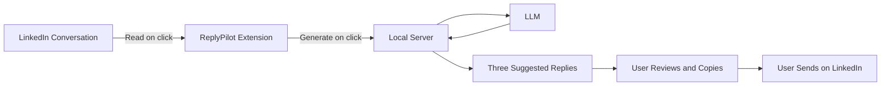

# ReplyPilot

**Your words. A little easier.**

ReplyPilot is a Chrome and Edge extension that helps you draft natural LinkedIn replies with AI.

It reads the current conversation, suggests three reply candidates, and lets you review and copy them before sending.

> **ReplyPilot never sends messages automatically.** Every reply is reviewed and sent by the user.

## Features

- ✨ **Conversation Preview** — Review the contact, latest incoming message, and recent conversation before generating replies.
- 🎯 **Personalized Replies** — Choose Friendly, Professional, or Casual tone with Short or Medium length.
- 📝 **Style Preferences** — Set natural wording, avoid robotic language, exclude emojis, and add your own writing instructions.
- 📋 **One-click Copy** — Compare three candidates and copy the reply you prefer.
- 🧪 **Demo Mode** — Try the connection with fixed sample replies, without an API key.

## Why ReplyPilot?

Writing replies on LinkedIn often means repeating the same ideas in slightly different ways. ReplyPilot helps you:

- Keep replies natural.
- Stay consistent with your writing style.
- Spend less time drafting.
- Remain in control by reviewing every response before sending.

## Human-in-the-Loop Design

ReplyPilot suggests; you decide. It reads the conversation when you click **Read conversation**, and generates candidates when you click **Generate replies**. You check the wording, facts, and commitments before copying a reply and sending it yourself on LinkedIn.

## Architecture



By default, the local server uses **Claude Haiku 4.5** through the Anthropic API. Support for additional LLM providers is planned.

## Quick Start

### 1. Run the local server

**Requirements:** Node.js 20.6 or later, Chrome or Edge, and an Anthropic API key for live generation. API usage is billed to your Anthropic account.

```sh
git clone https://github.com/NiceGuy1313/ReplyPilot.git
cd ReplyPilot/server
npm ci
cp .env.example .env
```

Edit `server/.env`:

```env
ANTHROPIC_API_KEY=your_api_key
ANTHROPIC_MODEL=claude-haiku-4-5-20251001
DEMO_MODE=false
```

Start the server:

```sh
npm start
```

The server runs at `http://localhost:3000`. To try it without an API key, use `DEMO_MODE=true`. Demo replies are fixed examples, not responses tailored to your conversation.

### 2. Load the extension

1. Open `chrome://extensions` in Chrome or `edge://extensions` in Edge.
2. Enable **Developer mode**.
3. Select **Load unpacked**.
4. Choose the repository's **`extension`** folder.
5. Pin ReplyPilot to your toolbar.

## Usage

1. Keep the local server running and open a conversation in [LinkedIn Messaging](https://www.linkedin.com/messaging/).
2. Open ReplyPilot and click **Read conversation**.
3. Review the conversation, then choose your tone, length, and **My style** preferences.
4. Click **Generate replies** to receive three candidates.
5. Review a reply, click **Copy**, and paste it into LinkedIn to send yourself.

The interface and system prompt are in English. **Use natural English** is enabled by default; turn it off to match the language of the contact's message.

Read the conversation again after switching threads. Style preferences are saved locally in your browser; the short-reply preference overrides the selected length.

## Privacy and Limitations

- Clicking **Generate replies** sends the previewed conversation and style preferences through the local server to Anthropic. The provider's data policies apply to submitted data.
- The API key stays in the server's `.env` file, which is excluded from Git. It is not stored in the extension.
- Conversations and reply candidates remain in popup memory and disappear when you close it. The server does not write conversations or API keys to files.
- ReplyPilot uses up to 10 recently loaded messages, with a maximum of 2,000 characters per message. It does not scroll through or load older history.
- Only 1:1 conversations are supported. Reading stops if multiple conversations are detected or the contact cannot be identified reliably.
- Conversation extraction depends on LinkedIn's page structure and may need updates when the interface changes.
- The server binds to `127.0.0.1:3000` and is intended for local use. It does not authenticate other local applications; do not expose it to a public network.

## Troubleshooting

| Issue | What to check |
| --- | --- |
| Cannot connect to the server | Run `npm start` from `server/`. Check `http://localhost:3000/health`. |
| Cannot read the conversation | Wait for messages to load, reload the extension and LinkedIn tab, and check the `RP-read-v4` diagnostic details. |
| API request fails | Check the API key, model, and account limits in `.env`, then restart the server. |
| Only fixed examples appear | Set `DEMO_MODE=false` and restart the server. |
| Repeated `chrome-extension://invalid/` errors | Disable ReplyPilot and reload the tab to compare. Check the failed request's Initiator in the Network panel to identify its source. |

After changing extension files, click **Reload (↻)** on the extensions page. Diagnostic errors may include detected names; redact them before sharing.

## Development

```text
extension/              Popup, conversation extraction, and server connection
  test/                 Conversation extraction tests
server/                 Express API, LLM requests, and input validation
  test/                 Input validation and API response tests
.github/workflows/      Automated tests
```

Run all tests from the repository root:

```sh
node --test server/test/replies.test.js extension/test/content.test.cjs
```

For automatic server restarts, run `npm run dev` from `server/`. Conversation extraction and clipboard behavior still need verification in a real LinkedIn session.

## Inspiration

ReplyPilot was inspired by Microsoft's learning materials on AI agents, human oversight, and responsible agent interaction.

While exploring these concepts through the Microsoft Learn Student Ambassadors program, I wanted to apply them to a small real-world workflow: helping users draft replies while keeping the final decision and sending action in human hands.

Explore [Microsoft Learn's AI agent guidance](https://learn.microsoft.com/agents/adoption-maturity-model/?wt.mc_id=studentamb_644438).

## Roadmap

The items below describe current functionality and possible future directions, rather than guaranteed release commitments.

- [x] LinkedIn reply suggestions
- [x] Custom writing style
- [ ] Multiple LLM providers
- [ ] Gmail support
- [ ] X (Twitter) support
- [ ] Slack support
- [ ] RAG-based memory
